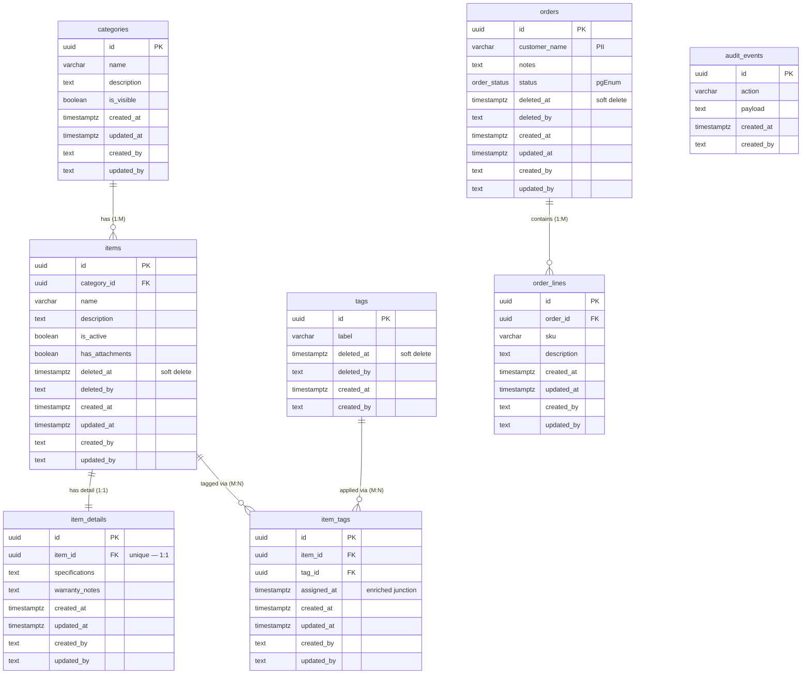

# DAL Test Schema — Entity Relationship Diagram

Co-located with `schema/` (one level up — Drizzle Kit imports all files under the schema path and cannot load `.md`).

Drizzle fixture schema for `@corpdk/dal-codegen` validation. Each entity exercises a distinct design guideline scenario (audit profile, delete strategy, relation pattern).

## Entity profiles

| Entity | Audit | Delete | Relation pattern |
| ------ | ----- | ------ | ---------------- |
| **categories** | full | hard | 1:M parent of items |
| **items** | full | soft | M:1 → categories; 1:1 → itemDetails; M:N → tags via itemTags |
| **itemDetails** | full | hard | 1:1 dependent of items (`itemId` unique FK) |
| **tags** | append-only | soft | M:N → items via itemTags |
| **itemTags** | full | hard | Enriched M:N junction (`assignedAt` + unique item+tag pair) |
| **orders** | full | soft | 1:M parent of orderLines |
| **orderLines** | full | hard | M:1 child of orders |
| **auditEvents** | append-only | hard | Standalone — no FK relations |

## Notes

- **1:1 (`items` ↔ `itemDetails`)**: FK on dependent `item_details.item_id` with unique index; optional extended specs separate from core item row.
- **Enriched junction (`itemTags`)**: M:N link table with business column `assignedAt` beyond the two FKs — not a pure link table.
- **Append-only**: `tags` and `auditEvents` have `createdAt` + `createdBy` only — no `updatedAt` / `updatedBy`.
- **Soft delete**: `deletedAt` (+ optional `deletedBy`) on `items`, `tags`, `orders`.
