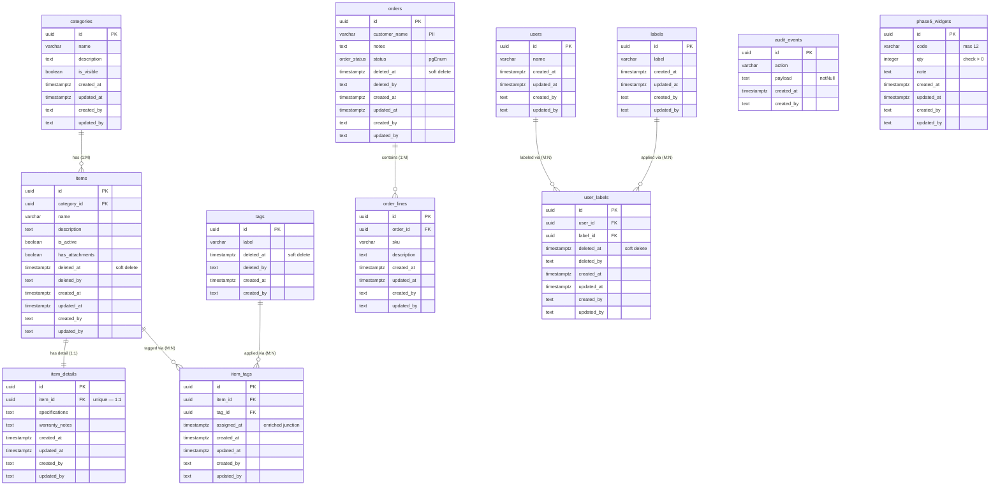

# DAL Test Schema — Entity Relationship Diagram

Co-located with `schema/` (one level up — Drizzle Kit imports all files under the schema path and cannot load `.md`).

Drizzle fixture schema for `@corpdk/dal-codegen` validation. Each entity exercises a distinct design guideline scenario (audit profile, delete strategy, relation pattern).

```mermaid
erDiagram
    categories ||--o{ items : "has (1:M)"
    items ||--|| item_details : "has detail (1:1)"
    items ||--o{ item_tags : "tagged via (M:N)"
    tags ||--o{ item_tags : "applied via (M:N)"
    orders ||--o{ order_lines : "contains (1:M)"
    users ||--o{ user_labels : "labeled via (M:N)"
    labels ||--o{ user_labels : "applied via (M:N)"

    categories {
        uuid id PK
        varchar name
        text description
        boolean is_visible
        timestamptz created_at
        timestamptz updated_at
        text created_by
        text updated_by
    }

    items {
        uuid id PK
        uuid category_id FK
        varchar name
        text description
        boolean is_active
        boolean has_attachments
        timestamptz deleted_at "soft delete"
        text deleted_by
        timestamptz created_at
        timestamptz updated_at
        text created_by
        text updated_by
    }

    item_details {
        uuid id PK
        uuid item_id FK "unique — 1:1"
        text specifications
        text warranty_notes
        timestamptz created_at
        timestamptz updated_at
        text created_by
        text updated_by
    }

    tags {
        uuid id PK
        varchar label
        timestamptz deleted_at "soft delete"
        text deleted_by
        timestamptz created_at
        text created_by
    }

    item_tags {
        uuid id PK
        uuid item_id FK
        uuid tag_id FK
        timestamptz assigned_at "enriched junction"
        timestamptz created_at
        timestamptz updated_at
        text created_by
        text updated_by
    }

    orders {
        uuid id PK
        varchar customer_name "PII"
        text notes
        order_status status "pgEnum"
        timestamptz deleted_at "soft delete"
        text deleted_by
        timestamptz created_at
        timestamptz updated_at
        text created_by
        text updated_by
    }

    order_lines {
        uuid id PK
        uuid order_id FK
        varchar sku
        text description
        timestamptz created_at
        timestamptz updated_at
        text created_by
        text updated_by
    }

    audit_events {
        uuid id PK
        varchar action
        text payload "notNull"
        timestamptz created_at
        text created_by
    }

    phase5_widgets {
        uuid id PK
        varchar code "max 12"
        integer qty "check > 0"
        text note
        timestamptz created_at
        timestamptz updated_at
        text created_by
        text updated_by
    }

    users {
        uuid id PK
        varchar name
        timestamptz created_at
        timestamptz updated_at
        text created_by
        text updated_by
    }

    labels {
        uuid id PK
        varchar label
        timestamptz created_at
        timestamptz updated_at
        text created_by
        text updated_by
    }

    user_labels {
        uuid id PK
        uuid user_id FK
        uuid label_id FK
        timestamptz deleted_at "soft delete"
        text deleted_by
        timestamptz created_at
        timestamptz updated_at
        text created_by
        text updated_by
    }
```

## Entity profiles

| Entity | Audit | Delete | Relation pattern |
| ------ | ----- | ------ | ---------------- |
| **categories** | full | hard | 1:M parent of items |
| **items** | full | soft | M:1 → categories; 1:1 → itemDetails; M:N → tags via itemTags |
| **itemDetails** | full | hard | 1:1 dependent of items (`itemId` unique FK) |
| **tags** | append-only | soft | M:N → items via itemTags |
| **itemTags** | full | hard | Enriched M:N junction (`assignedAt` + unique item+tag pair) |
| **orders** | full | soft | 1:M parent of orderLines |
| **orderLines** | full | hard | M:1 child of orders |
| **auditEvents** | append-only | hard | Standalone — no FK relations; `payload` required |
| **phase5Widgets** | full | hard | Standalone — `code` varchar(12), check `qty > 0` |
| **users** | full | hard | M:N → labels via userLabels |
| **labels** | full | hard | M:N → users via userLabels (distinct from item `tags`) |
| **userLabels** | full | soft | Pure M:N junction (FKs + audit only); unique user+label pair |

## Notes

- **GraphQL output (Phase 2)**: entity types expose **navigation fields** from Drizzle `relations()` — FK scalars (`categoryId`, `orderId`, etc.) are omitted from output types but remain on create/update inputs. Internal repository records still carry FK values for DataLoader batch keys.
- **1:1 (`items` ↔ `itemDetails`)**: FK on dependent `item_details.item_id` with unique index; optional extended specs separate from core item row.
- **Enriched junction (`itemTags`)**: M:N link table with business column `assignedAt` beyond the two FKs — not a pure link table.
- **Pure junction (`userLabels`)**: M:N link for Phase 5 navigation validation — FKs and audit columns only (contrast with `itemTags`); soft-deletable links without touching `users` / `labels`.
- **Phase 5 constraints (`phase5Widgets`)**: standalone row with `code` maxLength(12) and PostgreSQL check `qty > 0` — no `relations()` entry.
- **Append-only**: `tags` and `auditEvents` have `createdAt` + `createdBy` only — no `updatedAt` / `updatedBy`; `auditEvents.payload` is required (`notNull`).
- **Soft delete**: `deletedAt` (+ optional `deletedBy`) on `items`, `tags`, `orders`, and junction `userLabels`.
